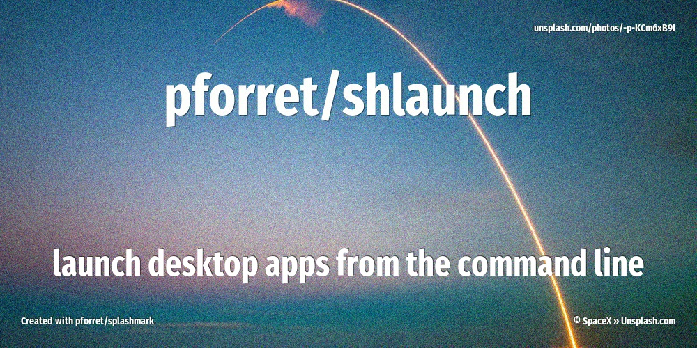

[](https://basher.gitparade.com/package/)

# shlaunch



Start applications like Lightroom/Sublime Text/Chrome from CLI

## 🔥 Usage

```
Program: shlaunch 0.1.0 by peter@forret.com
Updated: Apr  2 00:28:30 2021
Description: Run applications from CLI
Usage: shlaunch [-h] [-q] [-v] [-f] [-l <log_dir>] <action?> <input?>
Flags, options and parameters:
-h|--help        : [flag] show usage [default: off]
-q|--quiet       : [flag] no output [default: off]
-v|--verbose     : [flag] output more [default: off]
-f|--force       : [flag] do not ask for confirmation (always yes) [default: off]
-l|--log_dir <?> : [option] folder for log files   [default: /Users/pforret/log/shlaunch]
<action>         : [parameter] program to start: phpstorm/spotify/... (optional)
<input>          : [parameter] parameters to start progra with (optional)
@github.com:pforret/shlaunch.git
### TIPS & EXAMPLES
* use shlaunch [application] [folder/file] to start the application
  shlaunch phpstorm .
* use [alias] [folder/file] to start the [alias] application (alias = symlink to shlaunch)
  phpstorm .
  lightroom $HOME/Downloads
* use shlaunch check to check if this script is ready to execute and what values the options/flags are
  shlaunch check
* use shlaunch env to generate an example .env file
  shlaunch env > .env
* use shlaunch update to update to the latest version
  shlaunch check
```

## Aliases supported

* chrome
* filezilla
* lightroom
* photoshop
* phpstorm
* safari
* sublime

## 🚀 Installation

with [basher](https://github.com/basherpm/basher)

	$ basher install pforret/shlaunch

or with `git`

	$ git clone https://github.com/pforret/shlaunch.git
	$ cd shlaunch

## 📝 Acknowledgements

* script created with [bashew](https://github.com/pforret/bashew)

&copy; 2021 Peter Forret
